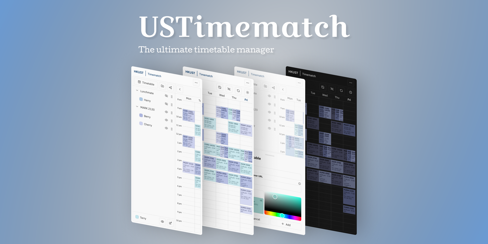

<br />
<div align="center">
  <a href="https://github.com/othneildrew/Best-README-Template">
    
  </a>
</div>

## About

USTimematch is a cross-platform web application built for HKUST students' time scheduling needs. It introduced a tree-based system to manage and import all you and your friends' timetable from an external calendar. With the timematch view, one could easily distinguish common time slots between friends or groupmates.

## Getting Started

To run the project locally, please follow these steps

### Prerequisites

Follow the instructions on <https://pnpm.io/installation> to install the package manager

### Development

1. Initialize a PostgreSQL instance

```sh
mkdir ~/postgres-data

docker run -d \
 --name dev-postgres \
 -e POSTGRES_PASSWORD=password \
 -v ${HOME}/postgres-data/:/var/lib/postgresql/data \
 -p 5432:5432 \
 postgres
```

2. For inspection, you can use pgAdmin

```sh
docker run -d \
  -p 80:80 \
  -e 'PGADMIN_DEFAULT_EMAIL=dev@dev.com' \
  -e 'PGADMIN_DEFAULT_PASSWORD=password' \
  --name pgadmin \
  dpage/pgadmin4
```

3. To initialize the database, run `pnpm dlx prisma db push`
4. To migrate to a newer schema, run `pnpm dlx prisma migrate dev`

> You can also setup a docker compose file to run all these services alongside with the Next.js frontend

### Environment Variables

A sample file has been provided [here](.env.example), certain part of the application might not work if things are omitted
